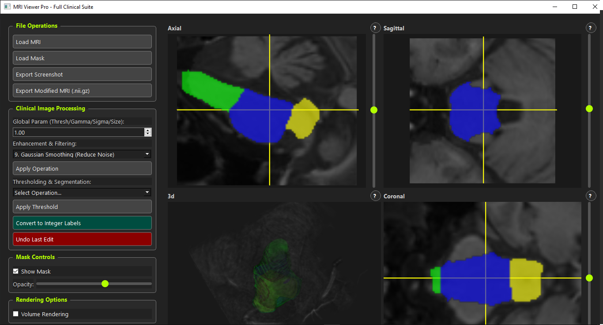

# Advanced 3D MRI Viewer



> ?? **Work in Progress!** ??
>
> This project is currently under active development. The core functionality is in place, but you may encounter bugs, and features are subject to change. Contributions of all kinds are warmly welcomed!

An advanced, feature-rich medical imaging viewer built with Python, designed for visualizing 3D MRI scans and their corresponding segmentation masks. This application is an evolving platform for researchers, clinicians, and students to inspect and analyze NIfTI-formatted medical data.

Built with the power of **VTK** for high-performance 3D rendering and **PyQt5** for a sleek, modern, and intuitive graphical user interface.

---

## Features

This viewer is a comprehensive inspection tool packed with essential features for medical image analysis:

-   **Interactive 4-Panel Layout**: Simultaneous and linked viewing of 3D volumetric rendering alongside 2D axial, sagittal, and coronal slices.
-   **NIfTI File Support**: Seamlessly load MRI and segmentation masks stored in the standard `.nii` or `.nii.gz` formats.
-   **Multi-Label Segmentation**:
    -   Automatically detects and renders multiple labels within a segmentation mask.
    -   Assigns distinct, vibrant colors to each label for clear differentiation in both 2D and 3D views.
-   **Advanced 3D Rendering**:
    -   **Volumetric MRI Display**: Renders the MRI scan as a 3D volume.
    -   **Smoothed Surface Rendering**: Generates aesthetically pleasing, smoothed 3D surfaces from segmentation masks.
    -   **Flexible View Modes**: Toggle the 3D view on-the-fly between `MRI Only`, `MRI + Mask`, and `Mask Only`.
-   **Independent Opacity Controls**:
    -   Fine-tune the transparency of the 3D mask.
    -   Independently adjust the opacity of the 2D mask overlays.
    -   Control the opacity of the 2D MRI slices to better visualize overlays.
-   **Intuitive Slice Navigation**: Use sliders to smoothly navigate through the slices in each of the 2D views.
-   **Modern UI**: A polished, dark-themed user interface.

---

## Future Goals & Planned Features

This project aims to grow. Here are some of the features on the roadmap. Help is wanted!

-   [ ] **Measurement Tools**: Implement tools for measuring distance, area, and angles in 2D views.
-   [ ] **ROI Analysis**: Add functionality to calculate statistics (e.g., mean intensity, volume) for segmented regions.
-   [ ] **DICOM Support**: Expand file support to include loading DICOM series.
-   [ ] **Window/Level Controls**: Add interactive controls for adjusting the contrast and brightness of the MRI scans.
-   [ ] **Export/Save Views**: Functionality to save the current view as a screenshot or export 3D models.
-   [ ] **UI Enhancements**: Custom color maps for segmentations, dockable widgets, etc.

---

## Installation

Getting the viewer up and running is straightforward. Ensure you have Python 3.6+ installed and then use `pip` to install the required libraries.

1.  **Clone the repository:**
    ```bash
    git clone https://github.com/robbinc91/advanced-3d-mri-viewer.git
    cd advanced-3d-mri-viewer
    ```

2.  **Install the dependencies:**
    It's highly recommended to use a virtual environment.
    ```bash
    # Create and activate a virtual environment
    python -m venv venv
    source venv/bin/activate  # On Windows, use `venv\Scripts\activate`

    # Install the required libraries
    pip install PyQt5 vtk numpy nibabel
    ```

---

## Usage

Once the dependencies are installed, you can run the application with a single command:

```bash
python mri_viewer.py
